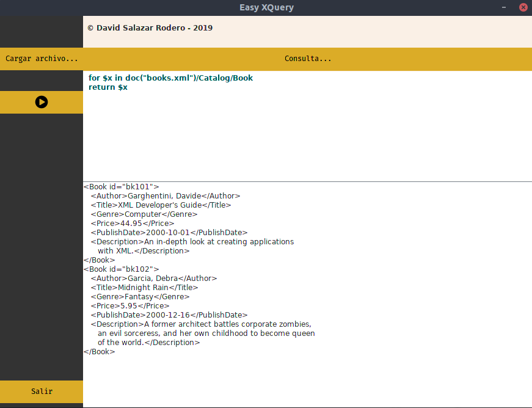

# easyXQUERY

easyXQUERY es un programa **muy básico** para poder realizar consultar FLWOR en un fichero .xml

La libería principal para poder realizar este proyecto es: [Saxon](http://www.saxonica.com/welcome/welcome.xml).

## Requirements:
  - JDK 11.
  - Librería Saxon.
 
### Info:

- It has not been tested on Windows or Mac.